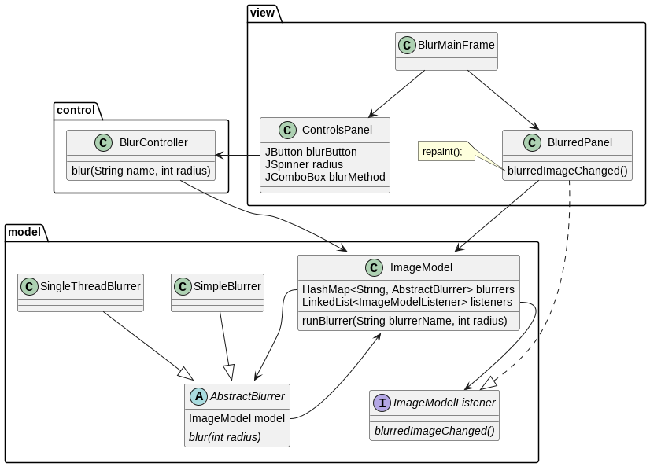

[![CC BY 4.0][cc-by-shield]][cc-by]

# Multithreading in Java

In diesem Repository befindet sich Beispielcode für eine Einführung in das Multithreading in Java.

Ein CheatSheet für die darin verwendeten Threading-Konzepte ist in der Datei [MultithreadingCheatsheet.md](MultithreadingCheatsheet.md) zu finden.

Der Programmaufbau ist hier grob gezeigt:

Das `ImageModel` enthält das unverwischte und das verwischte Bild - letzteres wird vom `BlurredPanel` angezeigt. Wird auf den "Blur"-Button geklickt, so werden die Werte aus dem Spinner und dem Dropdown an den `BlurController` übergeben, welcher sie an die Methode `runBlurrer(String blurrerName, int radius)` weitergibt.

Die Klassen, welche konkrete Herangehensweisen implementieren (im Diagramm exemplarisch `SingleThreadBlurrer` und `SimpleBlurrer`, mehrere weitere befinden sich in dem package `model`), implementieren das Interface `AbstractBlurrer`. Damit sie von dem Model gefunden werden, werden sie im Constructor von `ImageModel` instanziiert und einer internen `HashMap` hinzugefügt, welche die in dem GUI sichtbaren Namen den konkreten Blurrer-Objekten zuordnet.

Veränderungen an dem verwischten Bild können dem `view` über die Methode `blurredImageChanged()` von `ImageModel` mitgeteilt werden. Diese ruft wiederum die Methode `blurredImageChanged()` in allen registrierten `ImageModelListener`-Objekten auf (das `BlurredPanel` implementiert `ImageModelListener` und registriert sich während der Initialisierung im `ImageModel` als Listener, um bei Veränderungen benachrichtigt zu werden und diese anzuzeigen).

---

This work is licensed under a
[Creative Commons Attribution 4.0 International License][cc-by].

[![CC BY 4.0][cc-by-image]][cc-by]

[cc-by]: http://creativecommons.org/licenses/by/4.0/
[cc-by-image]: https://i.creativecommons.org/l/by/4.0/88x31.png
[cc-by-shield]: https://img.shields.io/badge/License-CC%20BY%204.0-lightgrey.svg
